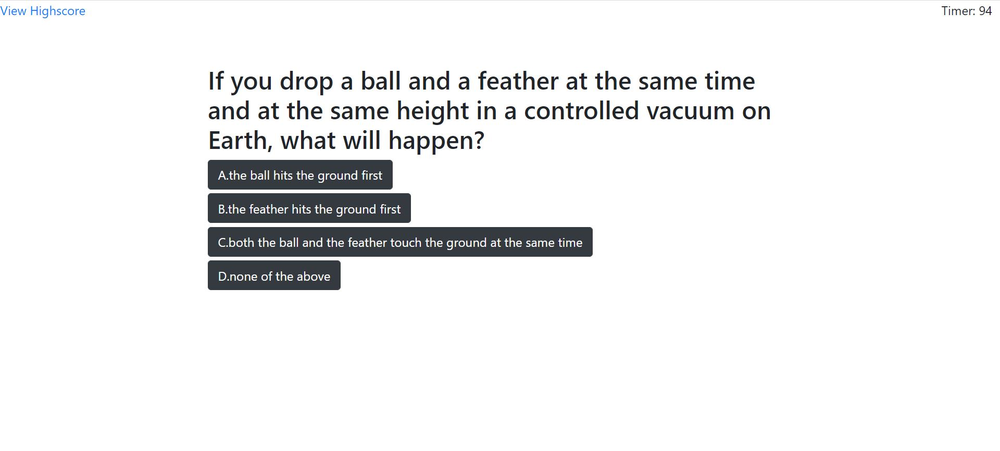

# Bootcamp-Quiz

## Overview

A short online quiz game. The quiz has a total of 4 questions. There is a timer and the final score is the remaining time. Each incorrect choice that player makes substracts 10 seconds from the timer. Players can view the highscore board.

### Usage

To play the quiz. Copy this link to a browser's clipboard and enter:

https://linhgt.github.io/Bootcamp-Quiz/

### Technologies

HTML, CSS, Jquery, Bootstrap, Javascript

### How it works

Click the start-quiz button at the beginning to start the quiz. The timer on the top right corner will start counting down from 99 to 0. 

One question is displayed on the screen and 4 answers are given as multiple choices. There is only one correct answer. If player makes the correct choice, an alert popups underneath the choices saying "correct". If an incorrect choice is made, a similar popups underneath the choices saying "incorrect". Incorrect choice substracts 10 seconds from the timer. No matter what choice the player makes, either correct or incorrect, the quiz displays the next question, and there is no way to get back to the previous question

if the timer reaches 0 before the player answers all questions, or all 4 questions have been answered, the quiz display the final screen

the highscores board is displayed once player enters their initials. Player can clears the highscore board or go back to the beginning of the quiz.

### Issues

Currently the sounds made when player makes a choice have an issue. If a choice is made too fast, no sound will be played because the previous question's sound hasn't finished.

